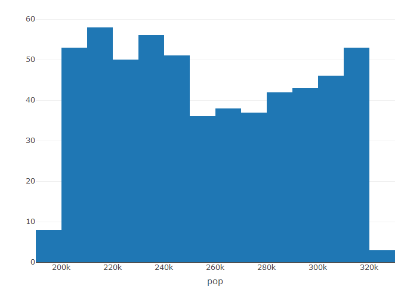
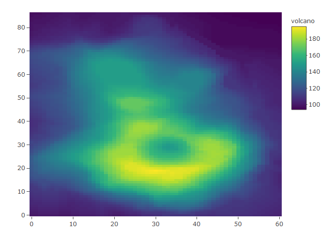
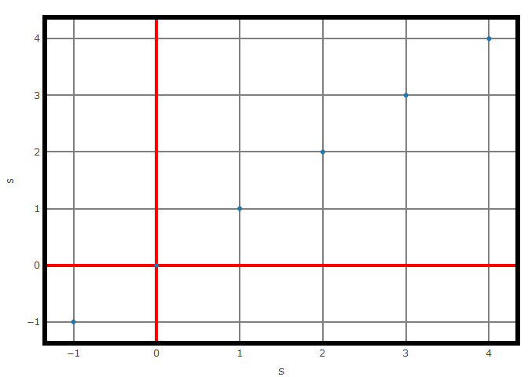
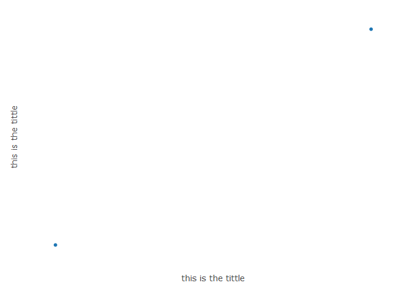
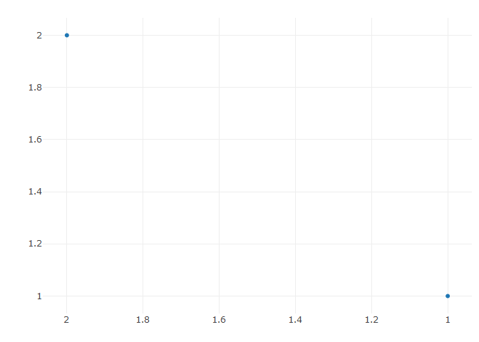
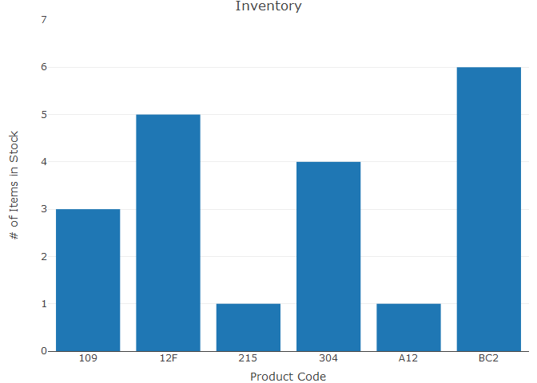
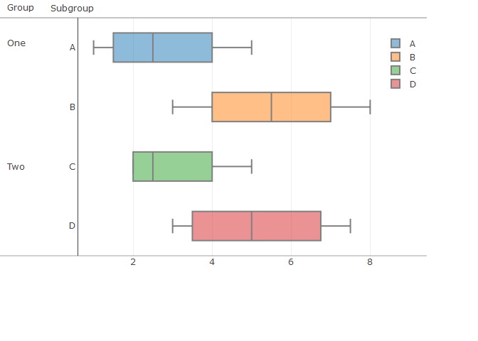
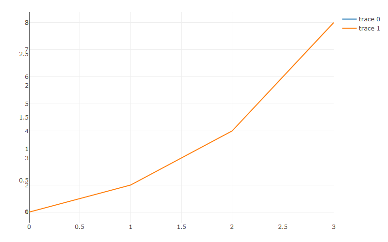
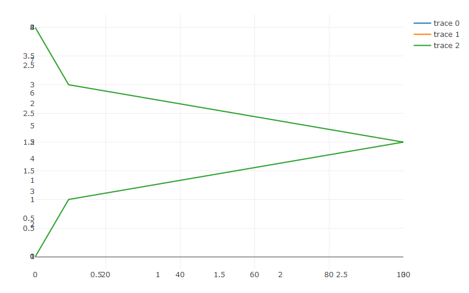
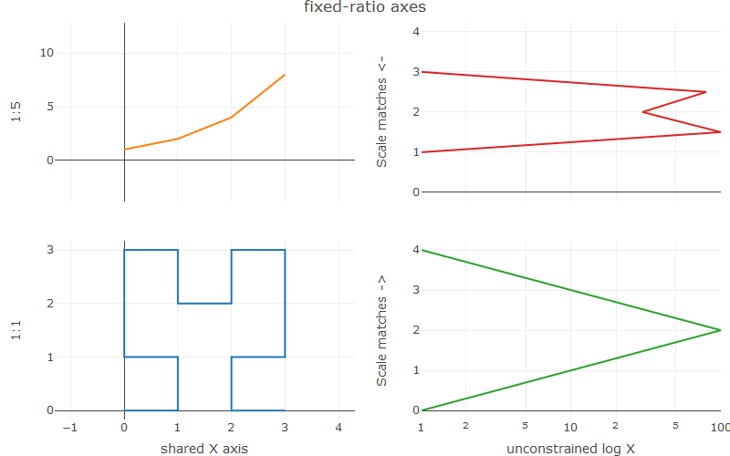

# Plotly Introduction Tutorials

Section 1 - Plotly Syntax  
1. Understanding the Plotly syntax/structure  
2. The data table, defining x-axis, y-axis and z-axis  
3. Adding line onto Plotly chart  
4. Adding Multiple line with different color  
5. Adding path and other Add\_\* to Plotly

Section 2 -Plotly Layout  
1. Basics of x and y axis  
2. Defining customizing lines and grid  
3. Ranges of x and y axis  
4. Plotting categorical data  
5. Box plot  
6. Adding Shapes and Annotation  
7. Merging Axis from multiple plot

Section 3 - Final Output  
1. Plotting a 3D plot, with custom axis  
2. Annotation and shapes overlay

``` r
library(plotly)
```

    ## Loading required package: ggplot2

    ## 
    ## Attaching package: 'plotly'

    ## The following object is masked from 'package:ggplot2':
    ## 
    ##     last_plot

    ## The following object is masked from 'package:stats':
    ## 
    ##     filter

    ## The following object is masked from 'package:graphics':
    ## 
    ##     layout

``` r
# plot_ly() tries to create a sensible plot based on the information you 
# give it. If you don't provide a trace type, plot_ly() will infer one.
plot_ly(economics, x = ~pop)
```

    ## No trace type specified:
    ##   Based on info supplied, a 'histogram' trace seems appropriate.
    ##   Read more about this trace type -> https://plotly.com/r/reference/#histogram

<!-- -->

``` r
plot_ly(economics, x = ~date, y = ~pop)
```

    ## No trace type specified:
    ##   Based on info supplied, a 'scatter' trace seems appropriate.
    ##   Read more about this trace type -> https://plotly.com/r/reference/#scatter

    ## No scatter mode specifed:
    ##   Setting the mode to markers
    ##   Read more about this attribute -> https://plotly.com/r/reference/#scatter-mode

<!-- -->

``` r
# plot_ly() doesn't require data frame(s), which allows one to take 
# advantage of trace type(s) designed specifically for numeric matrices
plot_ly(z = ~volcano)
```

    ## No trace type specified:
    ##   Based on info supplied, a 'heatmap' trace seems appropriate.
    ##   Read more about this trace type -> https://plotly.com/r/reference/#heatmap

<!-- -->

``` r
plot_ly(z = ~volcano, type = "surface")
```

<!-- -->

``` r
# plotly has a functional interface: every plotly function takes a plotly
# object as it's first input argument and returns a modified plotly object
add_lines(plot_ly(economics, x = ~date, y = ~unemploy/pop))
```

<!-- -->

``` r
# To make code more readable, plotly imports the pipe operator from magrittr
economics %>% plot_ly(x = ~date, y = ~unemploy/pop, z=~pce) %>% add_lines()
```

<!-- -->

``` r
economics %>% plot_ly(x = ~date, y = ~unemploy/pop) %>% add_paths()
```

<!-- -->

``` r
# Attributes defined via plot_ly() set 'global' attributes that 
# are carried onto subsequent traces, but those may be over-written
plot_ly(economics, x = ~date, color = I("black")) %>%
 add_lines(y = ~uempmed,color= I("yellow")) %>%
 add_lines(y = ~psavert, color = I("red"))
```

<!-- -->

``` r
# Attributes are documented in the figure reference -> https://plotly.com/r/reference
# You might notice plot_ly() has named arguments that aren't in this figure
# reference. These arguments make it easier to map abstract data values to
# visual attributes.
p <- plot_ly(palmerpenguins::penguins, x = ~bill_length_mm, y = ~body_mass_g)
p
```

    ## No trace type specified:
    ##   Based on info supplied, a 'scatter' trace seems appropriate.
    ##   Read more about this trace type -> https://plotly.com/r/reference/#scatter

    ## No scatter mode specifed:
    ##   Setting the mode to markers
    ##   Read more about this attribute -> https://plotly.com/r/reference/#scatter-mode

    ## Warning: Ignoring 2 observations

<!-- -->

``` r
p %>% add_lines(linetype = ~species)
```

<!-- -->

``` r
p %>% add_paths(linetype = ~species)
```

<!-- -->

``` r
library
```

    ## function (package, help, pos = 2, lib.loc = NULL, character.only = FALSE, 
    ##     logical.return = FALSE, warn.conflicts, quietly = FALSE, 
    ##     verbose = getOption("verbose"), mask.ok, exclude, include.only, 
    ##     attach.required = missing(include.only)) 
    ## {
    ##     conf.ctrl <- getOption("conflicts.policy")
    ##     if (is.character(conf.ctrl)) 
    ##         conf.ctrl <- switch(conf.ctrl, strict = list(error = TRUE, 
    ##             warn = FALSE), depends.ok = list(error = TRUE, generics.ok = TRUE, 
    ##             can.mask = c("base", "methods", "utils", "grDevices", 
    ##                 "graphics", "stats"), depends.ok = TRUE), warning(gettextf("unknown conflict policy: %s", 
    ##             sQuote(conf.ctrl)), call. = FALSE, domain = NA))
    ##     if (!is.list(conf.ctrl)) 
    ##         conf.ctrl <- NULL
    ##     stopOnConflict <- isTRUE(conf.ctrl$error)
    ##     if (missing(warn.conflicts)) 
    ##         warn.conflicts <- if (isFALSE(conf.ctrl$warn)) 
    ##             FALSE
    ##         else TRUE
    ##     if ((!missing(include.only)) && (!missing(exclude))) 
    ##         stop(gettext("only one of 'include.only' and 'exclude' can be used"), 
    ##             call. = FALSE, domain = NA)
    ##     testRversion <- function(pkgInfo, pkgname, pkgpath) {
    ##         if (is.null(built <- pkgInfo$Built)) 
    ##             stop(gettextf("package %s has not been installed properly\n", 
    ##                 sQuote(pkgname)), call. = FALSE, domain = NA)
    ##         R_version_built_under <- as.numeric_version(built$R)
    ##         if (R_version_built_under < "3.0.0") 
    ##             stop(gettextf("package %s was built before R 3.0.0: please re-install it", 
    ##                 sQuote(pkgname)), call. = FALSE, domain = NA)
    ##         current <- getRversion()
    ##         if (length(Rdeps <- pkgInfo$Rdepends2)) {
    ##             for (dep in Rdeps) if (length(dep) > 1L) {
    ##                 target <- dep$version
    ##                 res <- do.call(dep$op, if (is.character(target)) 
    ##                   list(as.numeric(R.version[["svn rev"]]), as.numeric(sub("^r", 
    ##                     "", target)))
    ##                 else list(current, as.numeric_version(target)))
    ##                 if (!res) 
    ##                   stop(gettextf("This is R %s, package %s needs %s %s", 
    ##                     current, sQuote(pkgname), dep$op, target), 
    ##                     call. = FALSE, domain = NA)
    ##             }
    ##         }
    ##         if (R_version_built_under > current) 
    ##             warning(gettextf("package %s was built under R version %s", 
    ##                 sQuote(pkgname), as.character(built$R)), call. = FALSE, 
    ##                 domain = NA)
    ##         platform <- built$Platform
    ##         r_arch <- .Platform$r_arch
    ##         if (.Platform$OS.type == "unix") {
    ##         }
    ##         else {
    ##             if (nzchar(platform) && !grepl("mingw", platform)) 
    ##                 stop(gettextf("package %s was built for %s", 
    ##                   sQuote(pkgname), platform), call. = FALSE, 
    ##                   domain = NA)
    ##         }
    ##         if (nzchar(r_arch) && file.exists(file.path(pkgpath, 
    ##             "libs")) && !file.exists(file.path(pkgpath, "libs", 
    ##             r_arch))) 
    ##             stop(gettextf("package %s is not installed for 'arch = %s'", 
    ##                 sQuote(pkgname), r_arch), call. = FALSE, domain = NA)
    ##     }
    ##     checkNoGenerics <- function(env, pkg) {
    ##         nenv <- env
    ##         ns <- .getNamespace(as.name(pkg))
    ##         if (!is.null(ns)) 
    ##             nenv <- asNamespace(ns)
    ##         if (exists(".noGenerics", envir = nenv, inherits = FALSE)) 
    ##             TRUE
    ##         else {
    ##             !any(startsWith(names(env), ".__T"))
    ##         }
    ##     }
    ##     checkConflicts <- function(package, pkgname, pkgpath, nogenerics, 
    ##         env) {
    ##         dont.mind <- c("last.dump", "last.warning", ".Last.value", 
    ##             ".Random.seed", ".Last.lib", ".onDetach", ".packageName", 
    ##             ".noGenerics", ".required", ".no_S3_generics", ".Depends", 
    ##             ".requireCachedGenerics")
    ##         sp <- search()
    ##         lib.pos <- which(sp == pkgname)
    ##         ob <- names(as.environment(lib.pos))
    ##         if (!nogenerics) {
    ##             these <- ob[startsWith(ob, ".__T__")]
    ##             gen <- gsub(".__T__(.*):([^:]+)", "\\1", these)
    ##             from <- gsub(".__T__(.*):([^:]+)", "\\2", these)
    ##             gen <- gen[from != package]
    ##             ob <- ob[!(ob %in% gen)]
    ##         }
    ##         ipos <- seq_along(sp)[-c(lib.pos, match(c("Autoloads", 
    ##             "CheckExEnv"), sp, 0L))]
    ##         cpos <- NULL
    ##         conflicts <- vector("list", 0)
    ##         for (i in ipos) {
    ##             obj.same <- match(names(as.environment(i)), ob, nomatch = 0L)
    ##             if (any(obj.same > 0L)) {
    ##                 same <- ob[obj.same]
    ##                 same <- same[!(same %in% dont.mind)]
    ##                 Classobjs <- which(startsWith(same, ".__"))
    ##                 if (length(Classobjs)) 
    ##                   same <- same[-Classobjs]
    ##                 same.isFn <- function(where) vapply(same, exists, 
    ##                   NA, where = where, mode = "function", inherits = FALSE)
    ##                 same <- same[same.isFn(i) == same.isFn(lib.pos)]
    ##                 not.Ident <- function(ch, TRAFO = identity, ...) vapply(ch, 
    ##                   function(.) !identical(TRAFO(get(., i)), TRAFO(get(., 
    ##                     lib.pos)), ...), NA)
    ##                 if (length(same)) 
    ##                   same <- same[not.Ident(same)]
    ##                 if (length(same) && identical(sp[i], "package:base")) 
    ##                   same <- same[not.Ident(same, ignore.environment = TRUE)]
    ##                 if (length(same)) {
    ##                   conflicts[[sp[i]]] <- same
    ##                   cpos[sp[i]] <- i
    ##                 }
    ##             }
    ##         }
    ##         if (length(conflicts)) {
    ##             if (stopOnConflict) {
    ##                 emsg <- ""
    ##                 pkg <- names(conflicts)
    ##                 notOK <- vector("list", 0)
    ##                 for (i in seq_along(conflicts)) {
    ##                   pkgname <- sub("^package:", "", pkg[i])
    ##                   if (pkgname %in% canMaskEnv$canMask) 
    ##                     next
    ##                   same <- conflicts[[i]]
    ##                   if (is.list(mask.ok)) 
    ##                     myMaskOK <- mask.ok[[pkgname]]
    ##                   else myMaskOK <- mask.ok
    ##                   if (isTRUE(myMaskOK)) 
    ##                     same <- NULL
    ##                   else if (is.character(myMaskOK)) 
    ##                     same <- setdiff(same, myMaskOK)
    ##                   if (length(same)) {
    ##                     notOK[[pkg[i]]] <- same
    ##                     msg <- .maskedMsg(sort(same), pkg = sQuote(pkg[i]), 
    ##                       by = cpos[i] < lib.pos)
    ##                     emsg <- paste(emsg, msg, sep = "\n")
    ##                   }
    ##                 }
    ##                 if (length(notOK)) {
    ##                   msg <- gettextf("Conflicts attaching package %s:\n%s", 
    ##                     sQuote(package), emsg)
    ##                   stop(errorCondition(msg, package = package, 
    ##                     conflicts = conflicts, class = "packageConflictError"))
    ##                 }
    ##             }
    ##             if (warn.conflicts) {
    ##                 packageStartupMessage(gettextf("\nAttaching package: %s\n", 
    ##                   sQuote(package)), domain = NA)
    ##                 pkg <- names(conflicts)
    ##                 for (i in seq_along(conflicts)) {
    ##                   msg <- .maskedMsg(sort(conflicts[[i]]), pkg = sQuote(pkg[i]), 
    ##                     by = cpos[i] < lib.pos)
    ##                   packageStartupMessage(msg, domain = NA)
    ##                 }
    ##             }
    ##         }
    ##     }
    ##     if (verbose && quietly) 
    ##         message("'verbose' and 'quietly' are both true; being verbose then ..")
    ##     if (!missing(package)) {
    ##         if (is.null(lib.loc)) 
    ##             lib.loc <- .libPaths()
    ##         lib.loc <- lib.loc[dir.exists(lib.loc)]
    ##         if (!character.only) 
    ##             package <- as.character(substitute(package))
    ##         if (length(package) != 1L) 
    ##             stop("'package' must be of length 1")
    ##         if (is.na(package) || (package == "")) 
    ##             stop("invalid package name")
    ##         pkgname <- paste0("package:", package)
    ##         newpackage <- is.na(match(pkgname, search()))
    ##         if (newpackage) {
    ##             pkgpath <- find.package(package, lib.loc, quiet = TRUE, 
    ##                 verbose = verbose)
    ##             if (length(pkgpath) == 0L) {
    ##                 if (length(lib.loc) && !logical.return) 
    ##                   stop(packageNotFoundError(package, lib.loc, 
    ##                     sys.call()))
    ##                 txt <- if (length(lib.loc)) 
    ##                   gettextf("there is no package called %s", sQuote(package))
    ##                 else gettext("no library trees found in 'lib.loc'")
    ##                 if (logical.return) {
    ##                   warning(txt, domain = NA)
    ##                   return(FALSE)
    ##                 }
    ##                 else stop(txt, domain = NA)
    ##             }
    ##             which.lib.loc <- normalizePath(dirname(pkgpath), 
    ##                 "/", TRUE)
    ##             pfile <- system.file("Meta", "package.rds", package = package, 
    ##                 lib.loc = which.lib.loc)
    ##             if (!nzchar(pfile)) 
    ##                 stop(gettextf("%s is not a valid installed package", 
    ##                   sQuote(package)), domain = NA)
    ##             pkgInfo <- readRDS(pfile)
    ##             testRversion(pkgInfo, package, pkgpath)
    ##             if (is.character(pos)) {
    ##                 npos <- match(pos, search())
    ##                 if (is.na(npos)) {
    ##                   warning(gettextf("%s not found on search path, using pos = 2", 
    ##                     sQuote(pos)), domain = NA)
    ##                   pos <- 2
    ##                 }
    ##                 else pos <- npos
    ##             }
    ##             deps <- unique(names(pkgInfo$Depends))
    ##             depsOK <- isTRUE(conf.ctrl$depends.ok)
    ##             if (depsOK) {
    ##                 canMaskEnv <- dynGet("__library_can_mask__", 
    ##                   NULL)
    ##                 if (is.null(canMaskEnv)) {
    ##                   canMaskEnv <- new.env()
    ##                   canMaskEnv$canMask <- union("base", conf.ctrl$can.mask)
    ##                   "__library_can_mask__" <- canMaskEnv
    ##                 }
    ##                 canMaskEnv$canMask <- unique(c(package, deps, 
    ##                   canMaskEnv$canMask))
    ##             }
    ##             else canMaskEnv <- NULL
    ##             if (attach.required) 
    ##                 .getRequiredPackages2(pkgInfo, quietly = quietly)
    ##             cr <- conflictRules(package)
    ##             if (missing(mask.ok)) 
    ##                 mask.ok <- cr$mask.ok
    ##             if (missing(exclude)) 
    ##                 exclude <- cr$exclude
    ##             if (packageHasNamespace(package, which.lib.loc)) {
    ##                 if (isNamespaceLoaded(package)) {
    ##                   newversion <- as.numeric_version(pkgInfo$DESCRIPTION["Version"])
    ##                   oldversion <- as.numeric_version(getNamespaceVersion(package))
    ##                   if (newversion != oldversion) {
    ##                     tryCatch(unloadNamespace(package), error = function(e) {
    ##                       P <- if (!is.null(cc <- conditionCall(e))) 
    ##                         paste("Error in", deparse(cc)[1L], ": ")
    ##                       else "Error : "
    ##                       stop(gettextf("Package %s version %s cannot be unloaded:\n %s", 
    ##                         sQuote(package), oldversion, paste0(P, 
    ##                           conditionMessage(e), "\n")), domain = NA)
    ##                     })
    ##                   }
    ##                 }
    ##                 tt <- tryCatch({
    ##                   attr(package, "LibPath") <- which.lib.loc
    ##                   ns <- loadNamespace(package, lib.loc)
    ##                   env <- attachNamespace(ns, pos = pos, deps, 
    ##                     exclude, include.only)
    ##                 }, error = function(e) {
    ##                   P <- if (!is.null(cc <- conditionCall(e))) 
    ##                     paste(" in", deparse(cc)[1L])
    ##                   else ""
    ##                   msg <- gettextf("package or namespace load failed for %s%s:\n %s", 
    ##                     sQuote(package), P, conditionMessage(e))
    ##                   if (logical.return) 
    ##                     message(paste("Error:", msg), domain = NA)
    ##                   else stop(msg, call. = FALSE, domain = NA)
    ##                 })
    ##                 if (logical.return && is.null(tt)) 
    ##                   return(FALSE)
    ##                 attr(package, "LibPath") <- NULL
    ##                 {
    ##                   on.exit(detach(pos = pos))
    ##                   nogenerics <- !.isMethodsDispatchOn() || checkNoGenerics(env, 
    ##                     package)
    ##                   if (isFALSE(conf.ctrl$generics.ok) || (stopOnConflict && 
    ##                     !isTRUE(conf.ctrl$generics.ok))) 
    ##                     nogenerics <- TRUE
    ##                   if (stopOnConflict || (warn.conflicts && !exists(".conflicts.OK", 
    ##                     envir = env, inherits = FALSE))) 
    ##                     checkConflicts(package, pkgname, pkgpath, 
    ##                       nogenerics, ns)
    ##                   on.exit()
    ##                   if (logical.return) 
    ##                     return(TRUE)
    ##                   else return(invisible(.packages()))
    ##                 }
    ##             }
    ##             else stop(gettextf("package %s does not have a namespace and should be re-installed", 
    ##                 sQuote(package)), domain = NA)
    ##         }
    ##         if (verbose && !newpackage) 
    ##             warning(gettextf("package %s already present in search()", 
    ##                 sQuote(package)), domain = NA)
    ##     }
    ##     else if (!missing(help)) {
    ##         if (!character.only) 
    ##             help <- as.character(substitute(help))
    ##         pkgName <- help[1L]
    ##         pkgPath <- find.package(pkgName, lib.loc, verbose = verbose)
    ##         docFiles <- c(file.path(pkgPath, "Meta", "package.rds"), 
    ##             file.path(pkgPath, "INDEX"))
    ##         if (file.exists(vignetteIndexRDS <- file.path(pkgPath, 
    ##             "Meta", "vignette.rds"))) 
    ##             docFiles <- c(docFiles, vignetteIndexRDS)
    ##         pkgInfo <- vector("list", 3L)
    ##         readDocFile <- function(f) {
    ##             if (basename(f) %in% "package.rds") {
    ##                 txt <- readRDS(f)$DESCRIPTION
    ##                 if ("Encoding" %in% names(txt)) {
    ##                   to <- if (Sys.getlocale("LC_CTYPE") == "C") 
    ##                     "ASCII//TRANSLIT"
    ##                   else ""
    ##                   tmp <- try(iconv(txt, from = txt["Encoding"], 
    ##                     to = to))
    ##                   if (!inherits(tmp, "try-error")) 
    ##                     txt <- tmp
    ##                   else warning("'DESCRIPTION' has an 'Encoding' field and re-encoding is not possible", 
    ##                     call. = FALSE)
    ##                 }
    ##                 nm <- paste0(names(txt), ":")
    ##                 formatDL(nm, txt, indent = max(nchar(nm, "w")) + 
    ##                   3L)
    ##             }
    ##             else if (basename(f) %in% "vignette.rds") {
    ##                 txt <- readRDS(f)
    ##                 if (is.data.frame(txt) && nrow(txt)) 
    ##                   cbind(basename(gsub("\\.[[:alpha:]]+$", "", 
    ##                     txt$File)), paste(txt$Title, paste0(rep.int("(source", 
    ##                     NROW(txt)), ifelse(nzchar(txt$PDF), ", pdf", 
    ##                     ""), ")")))
    ##                 else NULL
    ##             }
    ##             else readLines(f)
    ##         }
    ##         for (i in which(file.exists(docFiles))) pkgInfo[[i]] <- readDocFile(docFiles[i])
    ##         y <- list(name = pkgName, path = pkgPath, info = pkgInfo)
    ##         class(y) <- "packageInfo"
    ##         return(y)
    ##     }
    ##     else {
    ##         if (is.null(lib.loc)) 
    ##             lib.loc <- .libPaths()
    ##         db <- matrix(character(), nrow = 0L, ncol = 3L)
    ##         nopkgs <- character()
    ##         for (lib in lib.loc) {
    ##             a <- .packages(all.available = TRUE, lib.loc = lib)
    ##             for (i in sort(a)) {
    ##                 file <- system.file("Meta", "package.rds", package = i, 
    ##                   lib.loc = lib)
    ##                 title <- if (nzchar(file)) {
    ##                   txt <- readRDS(file)
    ##                   if (is.list(txt)) 
    ##                     txt <- txt$DESCRIPTION
    ##                   if ("Encoding" %in% names(txt)) {
    ##                     to <- if (Sys.getlocale("LC_CTYPE") == "C") 
    ##                       "ASCII//TRANSLIT"
    ##                     else ""
    ##                     tmp <- try(iconv(txt, txt["Encoding"], to, 
    ##                       "?"))
    ##                     if (!inherits(tmp, "try-error")) 
    ##                       txt <- tmp
    ##                     else warning("'DESCRIPTION' has an 'Encoding' field and re-encoding is not possible", 
    ##                       call. = FALSE)
    ##                   }
    ##                   txt["Title"]
    ##                 }
    ##                 else NA
    ##                 if (is.na(title)) 
    ##                   title <- " ** No title available ** "
    ##                 db <- rbind(db, cbind(i, lib, title))
    ##             }
    ##             if (length(a) == 0L) 
    ##                 nopkgs <- c(nopkgs, lib)
    ##         }
    ##         dimnames(db) <- list(NULL, c("Package", "LibPath", "Title"))
    ##         if (length(nopkgs) && !missing(lib.loc)) {
    ##             pkglist <- paste(sQuote(nopkgs), collapse = ", ")
    ##             msg <- sprintf(ngettext(length(nopkgs), "library %s contains no packages", 
    ##                 "libraries %s contain no packages"), pkglist)
    ##             warning(msg, domain = NA)
    ##         }
    ##         y <- list(header = NULL, results = db, footer = NULL)
    ##         class(y) <- "libraryIQR"
    ##         return(y)
    ##     }
    ##     if (logical.return) 
    ##         TRUE
    ##     else invisible(.packages())
    ## }
    ## <bytecode: 0x0000000012ae4148>
    ## <environment: namespace:base>

``` r
a <- list(
  autotick = FALSE,
  ticks = "outside",
  tick0 = 0,
  dtick = 0.25,
  ticklen = 5,
  tickwidth = 2,
  tickcolor = toRGB("blue")
)
x <- seq(1, 4, by = 0.25)
y <- seq(1, 4, by = 0.25)


fig <- plot_ly(x = ~x, y = ~y)
fig <- fig %>% layout(xaxis = a, yaxis = a)

fig
```

    ## No trace type specified:
    ##   Based on info supplied, a 'scatter' trace seems appropriate.
    ##   Read more about this trace type -> https://plotly.com/r/reference/#scatter

    ## No scatter mode specifed:
    ##   Setting the mode to markers
    ##   Read more about this attribute -> https://plotly.com/r/reference/#scatter-mode

<!-- -->

``` r
library(plotly)
ax <- list(
  zeroline = TRUE,
  showline = TRUE,
  mirror = "ticks",
  gridcolor = toRGB("gray50"),
  gridwidth = 2,
  zerolinecolor = toRGB("red"),
  zerolinewidth = 4,
  linecolor = toRGB("black"),
  linewidth = 6
)
s <- seq(-1, 4)
fig <- plot_ly(x = ~s, y = ~s)
fig <- fig %>% layout(xaxis = ax, yaxis = ax)

fig
```

    ## No trace type specified:
    ##   Based on info supplied, a 'scatter' trace seems appropriate.
    ##   Read more about this trace type -> https://plotly.com/r/reference/#scatter

    ## No scatter mode specifed:
    ##   Setting the mode to markers
    ##   Read more about this attribute -> https://plotly.com/r/reference/#scatter-mode

<!-- -->

``` r
library(plotly)
ax <- list(
  title = "this is the tittle",
  zeroline = FALSE,
  showline = FALSE,
  showticklabels = FALSE,
  showgrid = FALSE
)

fig <- plot_ly(x = c(1, 2), y = c(1, 2))
fig <- fig %>% layout(xaxis = ax, yaxis = ax)


fig
```

    ## No trace type specified:
    ##   Based on info supplied, a 'scatter' trace seems appropriate.
    ##   Read more about this trace type -> https://plotly.com/r/reference/#scatter

    ## No scatter mode specifed:
    ##   Setting the mode to markers
    ##   Read more about this attribute -> https://plotly.com/r/reference/#scatter-mode

<!-- -->

``` r
library(plotly)
fig <- plot_ly(x = c(1, 2), y = c(1, 2))
fig <- fig %>% layout(xaxis = list(autorange = "reversed"))

fig
```

    ## No trace type specified:
    ##   Based on info supplied, a 'scatter' trace seems appropriate.
    ##   Read more about this trace type -> https://plotly.com/r/reference/#scatter

    ## No scatter mode specifed:
    ##   Setting the mode to markers
    ##   Read more about this attribute -> https://plotly.com/r/reference/#scatter-mode

<!-- -->

``` r
library(plotly)
x <- seq(0, 10, length=50)
y <- runif(n = 50, min = 0, max = 10)

fig <- plot_ly(x = x, y = y)
fig <- fig %>% layout(xaxis = list(range = c(0, 10)))

fig
```

    ## No trace type specified:
    ##   Based on info supplied, a 'scatter' trace seems appropriate.
    ##   Read more about this trace type -> https://plotly.com/r/reference/#scatter

    ## No scatter mode specifed:
    ##   Setting the mode to markers
    ##   Read more about this attribute -> https://plotly.com/r/reference/#scatter-mode

<!-- -->

``` r
library(plotly)

fig <- plot_ly(
  x = c('A12', 'BC2', 109, '12F', 215, 304),
  y = c(1,6,3,5,1,4),
  type = 'bar',
  name = 'Team A',
  text = c('Apples', 'Pears', 'Peaches', 'Bananas', 'Pineapples', 'Cherries')
)


fig <- fig %>% layout(
  title = 'Inventory',
  
  xaxis = list(
    type = 'category',
    title = 'Product Code'
  ),
  
  yaxis = list(
    title = '# of Items in Stock',
    range = c(0,7)
  )
)

fig
```

<!-- -->

``` r
#https://plotly.com/r/reference/layout/shapes/

fig <- plot_ly(orientation='h', line=list(color='gray'), height=400, width=600)
fig <- fig %>% add_boxplot(x=c(2,3,1,5), y=c('A','A','A','A'), name='A')
fig <- fig %>% add_boxplot(x=c(8,3,6,5), y=c('B','B','B','B'), name='B')
fig <- fig %>% add_boxplot(x=c(2,3,2,5), y=c('C','C','C','C'), name='C')
fig <- fig %>% add_boxplot(x=c(7.5,3,6,4), y=c('D','D','D','D'), name='D')

fig <- fig %>% layout(
    title = '',
    yaxis = list(
      autorange = TRUE, 
      categoryorder = "category descending", 
      domain = c(0, 1), 
      range = c(-0.5, 3.5), 
      showline = TRUE, 
      title = "", 
      type = "category"
    ),
    margin = list(
      r = 10, 
      t = 25, 
      b = 40, 
      l = 110
    ),
    legend = list(
      x = 0.98, 
      y = 0.98
    ) 
)

fig
```

<!-- -->

``` r
fig <- plot_ly(orientation='h', line=list(color='gray'), height=400, width=600)
fig <- fig %>% add_boxplot(x=c(2,3,1,5), y=c('A','A','A','A'), name='A')
fig <- fig %>% add_boxplot(x=c(8,3,6,5), y=c('B','B','B','B'), name='B')
fig <- fig %>% add_boxplot(x=c(2,3,2,5), y=c('C','C','C','C'), name='C')
fig <- fig %>% add_boxplot(x=c(7.5,3,6,4), y=c('D','D','D','D'), name='D')


fig <- fig %>% layout(
    title = '',
    yaxis = list(
      autorange = TRUE, 
      categoryorder = "category descending", 
      domain = c(0, 1), 
      range = c(-0.5, 3.5), 
      showline = TRUE, 
      title = "", 
      type = "category"
    ),
    margin = list(
      r = 10, 
      t = 25, 
      b = 40, 
      l = 110
    ),
    legend = list(
      x = 0.986145833333, 
      y = 0.936263886049
    ), 
    shapes = list(
      list(
        line = list(
          color = "rgba(68, 68, 68, 0.5)", 
          width = 1
        ), 
        type = "line", 
        x0 = -0.3, 
        x1 = 1.2, 
        xref = "paper", 
        y0 = 0, 
        y1 = 0, 
        yref = "paper"
      ), 
      list(
        line = list(
          color = "rgba(68, 68, 68, 0.63)", 
          width = 1
        ), 
        type = "line", 
        x0 = -0.3, 
        x1 = 1.2, 
        xref = "paper", 
        y0 = 1, 
        y1 = 1, 
        yref = "paper"
      )
    )
  )

fig
```

<!-- -->

``` r
fig <- fig %>% layout(
    title = '',
    yaxis = list(
      autorange = TRUE, 
      categoryorder = "category descending", 
      domain = c(0, 1), 
      range = c(-0.5, 3.5), 
      showline = TRUE, 
      title = "", 
      type = "category"
    ),
    margin = list(
      r = 10, 
      t = 25, 
      b = 40, 
      l = 110
    ),
    legend = list(
      x = 0.986145833333, 
      y = 0.936263886049
    ), 
    shapes = list(
      list(
        line = list(
          color = "rgba(68, 68, 68, 0.5)", 
          width = 1
        ), 
        type = "line", 
        x0 = -0.3, 
        x1 = 1.2, 
        xref = "paper", 
        y0 = 0.5, 
        y1 = 0.5, 
        yref = "paper"
      ), 
      list(
        line = list(
          color = "rgba(68, 68, 68, 0.63)", 
          width = 1
        ), 
        type = "line", 
        x0 = -0.3, 
        x1 = 1.2, 
        xref = "paper", 
        y0 = 1, 
        y1 = 1, 
        yref = "paper"
      )
    ),
    annotations = list(
        list(
          x = -0.0951769406393, 
          y = 1.06972670892, 
          showarrow = FALSE, 
          text = "Subgroup", 
          xref = "paper", 
          yref = "paper"
        ), 
        list(
          x = -0.235516552511, 
          y = 1.07060587474, 
          showarrow = FALSE, 
          text = "Group", 
          xref = "paper", 
          yref = "paper"
        ), 
        list(
          x = -0.235516552511, 
          y = 0.922906017856, 
          showarrow = FALSE, 
          text = "One", 
          xref = "paper", 
          yref = "paper"
        ), 
        list(
          x = -0.235516552511, 
          y = 0.375, 
          showarrow = FALSE, 
          text = "Two", 
          xref = "paper", 
          yref = "paper"
        )
      )
    )

fig
```

<!-- -->

``` r
library(plotly)

fig <- plot_ly(
    width = 800,
    height = 500
)

fig
```

    ## Warning: No trace type specified and no positional attributes specified

    ## No trace type specified:
    ##   Based on info supplied, a 'scatter' trace seems appropriate.
    ##   Read more about this trace type -> https://plotly.com/r/reference/#scatter

    ## No scatter mode specifed:
    ##   Setting the mode to markers
    ##   Read more about this attribute -> https://plotly.com/r/reference/#scatter-mode

<!-- -->

``` r
fig <- fig %>% add_trace(
    x = c(0,1,1,0,0,1,1,2,2,3,3,2,2,3),
    y = c(0,0,1,1,3,3,2,2,3,3,1,1,0,0),
    mode = 'lines'
  )

fig
```

    ## No trace type specified:
    ##   Based on info supplied, a 'scatter' trace seems appropriate.
    ##   Read more about this trace type -> https://plotly.com/r/reference/#scatter

<!-- -->

``` r
fig <- fig %>% add_trace(
    x = c(0,1,2,3),
    y = c(1,2,4,8),
    yaxis = "y2",
    mode = 'lines'
  )

fig
```

    ## No trace type specified:
    ##   Based on info supplied, a 'scatter' trace seems appropriate.
    ##   Read more about this trace type -> https://plotly.com/r/reference/#scatter
    ## No trace type specified:
    ##   Based on info supplied, a 'scatter' trace seems appropriate.
    ##   Read more about this trace type -> https://plotly.com/r/reference/#scatter

<!-- -->

``` r
fig <- fig %>% add_trace(
    x = c(1,10,100,10,1),
    y = c(0,1,2,3,4),
    xaxis = "x2",
    yaxis ="y3",
    mode = 'lines'
  )

fig
```

    ## No trace type specified:
    ##   Based on info supplied, a 'scatter' trace seems appropriate.
    ##   Read more about this trace type -> https://plotly.com/r/reference/#scatter
    ## No trace type specified:
    ##   Based on info supplied, a 'scatter' trace seems appropriate.
    ##   Read more about this trace type -> https://plotly.com/r/reference/#scatter
    ## No trace type specified:
    ##   Based on info supplied, a 'scatter' trace seems appropriate.
    ##   Read more about this trace type -> https://plotly.com/r/reference/#scatter

<!-- -->

``` r
fig <- fig %>% add_trace(
    x = c(1,100,30,80,1),
    y = c(1,1.5,2,2.5,3),
    xaxis = "x2",
    yaxis = "y4",
    mode = 'lines'
  )

fig
```

    ## No trace type specified:
    ##   Based on info supplied, a 'scatter' trace seems appropriate.
    ##   Read more about this trace type -> https://plotly.com/r/reference/#scatter
    ## No trace type specified:
    ##   Based on info supplied, a 'scatter' trace seems appropriate.
    ##   Read more about this trace type -> https://plotly.com/r/reference/#scatter
    ## No trace type specified:
    ##   Based on info supplied, a 'scatter' trace seems appropriate.
    ##   Read more about this trace type -> https://plotly.com/r/reference/#scatter
    ## No trace type specified:
    ##   Based on info supplied, a 'scatter' trace seems appropriate.
    ##   Read more about this trace type -> https://plotly.com/r/reference/#scatter

<!-- -->

``` r
fig <- fig %>% layout(
    title = "fixed-ratio axes",
    xaxis = list(
      nticks = 10,
      domain = c(0, 0.45),
      title = "shared X axis"
    ),
    yaxis = list(
      scaleanchor = "x",
      domain = c(0, 0.45),
      title = "1:1"
    ),
    yaxis2 = list(
      scaleanchor = "x",
      scaleratio = 0.2,
      domain = c(0.55,1),
      title = "1:5"
    ),
    xaxis2 = list(
      type = "log",
      domain = c(0.55, 1),
      anchor = "y3",
      title = "unconstrained log X"
    ),
    yaxis3 = list(
      domain = c(0, 0.45),
      anchor = "x2",
      title = "Scale matches ->"
    ),
    yaxis4 = list(
      scaleanchor = "y3",
      domain = c(0.55, 1),
      anchor = "x2",
      title = "Scale matches <-"
    ),
    showlegend= FALSE
)

fig
```

    ## No trace type specified:
    ##   Based on info supplied, a 'scatter' trace seems appropriate.
    ##   Read more about this trace type -> https://plotly.com/r/reference/#scatter
    ## No trace type specified:
    ##   Based on info supplied, a 'scatter' trace seems appropriate.
    ##   Read more about this trace type -> https://plotly.com/r/reference/#scatter
    ## No trace type specified:
    ##   Based on info supplied, a 'scatter' trace seems appropriate.
    ##   Read more about this trace type -> https://plotly.com/r/reference/#scatter
    ## No trace type specified:
    ##   Based on info supplied, a 'scatter' trace seems appropriate.
    ##   Read more about this trace type -> https://plotly.com/r/reference/#scatter

<!-- -->

``` r
set.seed(123)

# Create Random Data
ds <- diamonds[sample(1:nrow(diamonds), size = 1000),]

# Create lists for axis properties
f1 <- list(
  family = "Arial, sans-serif",
  size = 18,
  color = "lightgrey")

f2 <- list(
  family = "Old Standard TT, serif",
  size = 14,
  color = "#ff9999")

axis <- list(
  titlefont = f1,
  tickfont = f2,
  showgrid = F
)

scene = list(
  xaxis = axis,
  yaxis = axis,
  zaxis = axis,
  camera = list(eye = list(x = -1.25, y = 1.25, z = 1.25)))


fig <- plot_ly(ds, x = ~cut, y = ~clarity, z = ~price, type = 'scatter3d', mode = 'markers', marker = list(size = 3))
fig <- fig %>% layout(title = "3D Scatter plot", 
                      scene = scene)

fig
```

<!-- -->

``` r
set.seed(123)

# Create Random Data
ds <- diamonds[sample(1:nrow(diamonds), size = 1000),]

# Create lists for axis properties
f1 <- list(
  family = "Arial, sans-serif",
  size = 12,
  color = "lightgrey")

f2 <- list(
  family = "Old Standard TT, serif",
  size = 12,
  color = "#ff9999")

axis <- list(
  titlefont = f1,
  tickfont = f2,
  showgrid = F
)

scene = list(
  xaxis = axis,
  yaxis = axis,
  zaxis = axis,
  camera = list(eye = list(x = -2, y = 2, z = 1.25)))


fig <- plot_ly(ds, x = ~cut, y = ~clarity, z = ~price, type = 'scatter3d', mode = 'markers', marker = list(size = 3))
fig <- fig %>% layout(title = "3D Scatter plot", 
                      scene = scene,
                       margin = list(
                                      r = 10,
                                      t = 25, 
                                      b = 110, 
                                      l = 10
                                    ),
                      annotations = list(
                                        x = 0.5, 
                                        y = 0.0, 
                                        showarrow = FALSE, 
                                        text = "This is added with Annotation, but shouldn't", 
                                        xref = "paper", 
                                        yref = "paper"
                                      ),
                      shapes =      list(
                                      line = list(
                                        color = "rgba(68, 68, 68, 0.5)", 
                                        width = 1
                                      ), 
                                      type = "line", 
                                      x0 = 0.0, 
                                      x1 = 1.0, 
                                      xref = "paper", 
                                      y0 = -0.0, 
                                      y1 = 0.0, 
                                      yref = "paper"
                                    ) 
                    )
                      

fig
```

<!-- -->
