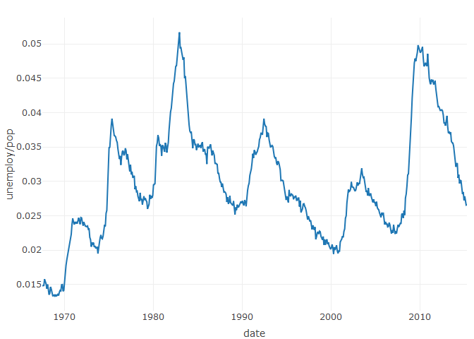
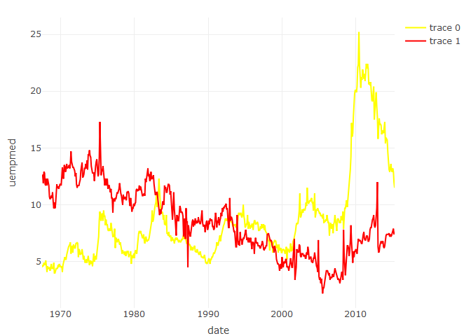
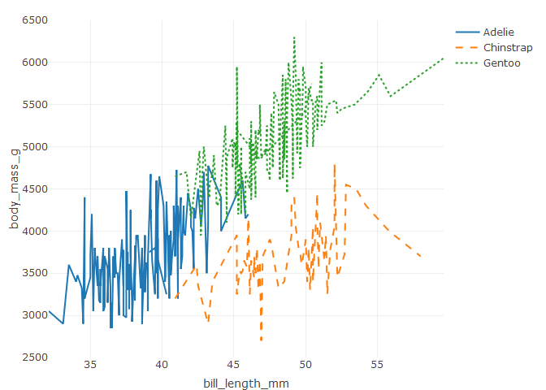
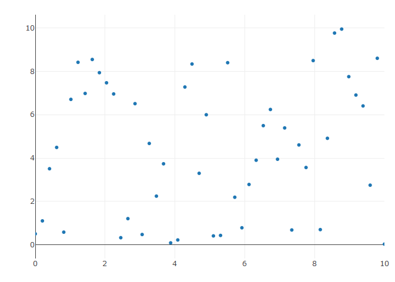
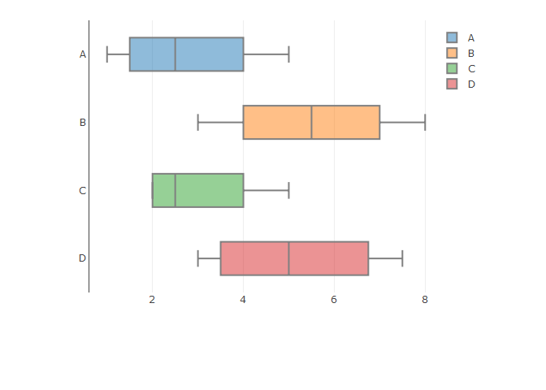
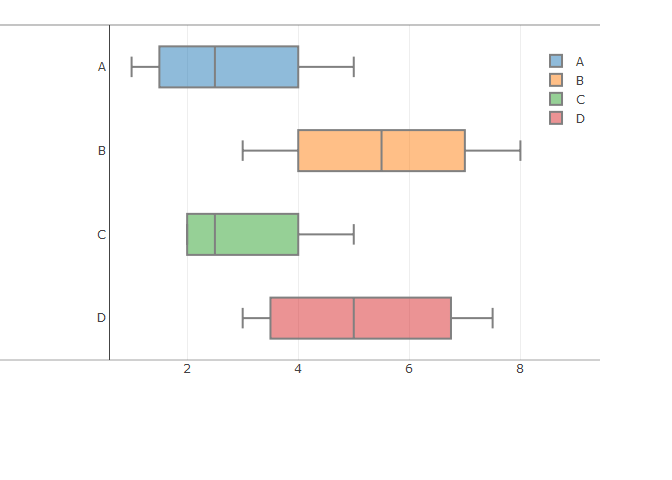
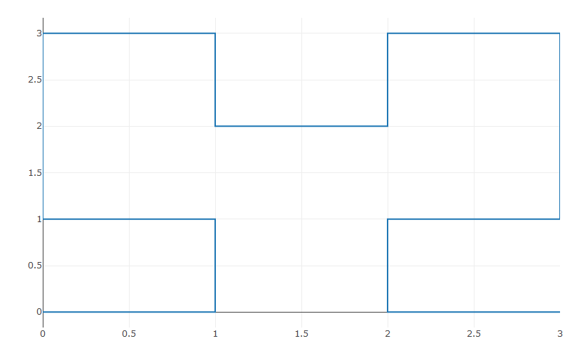

# Plotly Introduction Tutorials

Section 1 - Plotly Syntax  
1. Understanding the Plotly syntax/structure  
2. The data table, defining x-axis, y-axis and z-axis  
3. Adding line onto Plotly chart  
4. Adding Multiple line with different color  
5. Adding path and other Add\_\* to Plotly

Section 2 -Plotly Layout  
1. Basics of x and y axis  
2. Defining customizing lines and grid  
3. Ranges of x and y axis  
4. Plotting categorical data  
5. Box plot  
6. Adding Shapes and Annotation  
7. Merging Axis from multiple plot

Section 3 - Final Output  
1. Plotting a 3D plot, with custom axis  
2. Annotation and shapes overlay

``` r
library(plotly)
```

    ## Loading required package: ggplot2

    ## 
    ## Attaching package: 'plotly'

    ## The following object is masked from 'package:ggplot2':
    ## 
    ##     last_plot

    ## The following object is masked from 'package:stats':
    ## 
    ##     filter

    ## The following object is masked from 'package:graphics':
    ## 
    ##     layout

``` r
# plot_ly() tries to create a sensible plot based on the information you 
# give it. If you don't provide a trace type, plot_ly() will infer one.
plot_ly(economics, x = ~pop)
```

    ## No trace type specified:
    ##   Based on info supplied, a 'histogram' trace seems appropriate.
    ##   Read more about this trace type -> https://plotly.com/r/reference/#histogram

<!-- -->

``` r
plot_ly(economics, x = ~date, y = ~pop)
```

    ## No trace type specified:
    ##   Based on info supplied, a 'scatter' trace seems appropriate.
    ##   Read more about this trace type -> https://plotly.com/r/reference/#scatter

    ## No scatter mode specifed:
    ##   Setting the mode to markers
    ##   Read more about this attribute -> https://plotly.com/r/reference/#scatter-mode

<!-- -->

``` r
# plot_ly() doesn't require data frame(s), which allows one to take 
# advantage of trace type(s) designed specifically for numeric matrices
plot_ly(z = ~volcano)
```

    ## No trace type specified:
    ##   Based on info supplied, a 'heatmap' trace seems appropriate.
    ##   Read more about this trace type -> https://plotly.com/r/reference/#heatmap

<!-- -->

``` r
plot_ly(z = ~volcano, type = "surface")
```

<!-- -->

``` r
# plotly has a functional interface: every plotly function takes a plotly
# object as it's first input argument and returns a modified plotly object
add_lines(plot_ly(economics, x = ~date, y = ~unemploy/pop))
```

<!-- -->

``` r
# To make code more readable, plotly imports the pipe operator from magrittr
economics %>% plot_ly(x = ~date, y = ~unemploy/pop, z=~pce) %>% add_lines()
```

<!-- -->

``` r
economics %>% plot_ly(x = ~date, y = ~unemploy/pop) %>% add_paths()
```

<!-- -->

``` r
# Attributes defined via plot_ly() set 'global' attributes that 
# are carried onto subsequent traces, but those may be over-written
plot_ly(economics, x = ~date, color = I("black")) %>%
 add_lines(y = ~uempmed,color= I("yellow")) %>%
 add_lines(y = ~psavert, color = I("red"))
```

<!-- -->

``` r
# Attributes are documented in the figure reference -> https://plotly.com/r/reference
# You might notice plot_ly() has named arguments that aren't in this figure
# reference. These arguments make it easier to map abstract data values to
# visual attributes.
p <- plot_ly(palmerpenguins::penguins, x = ~bill_length_mm, y = ~body_mass_g)
p
```

    ## No trace type specified:
    ##   Based on info supplied, a 'scatter' trace seems appropriate.
    ##   Read more about this trace type -> https://plotly.com/r/reference/#scatter

    ## No scatter mode specifed:
    ##   Setting the mode to markers
    ##   Read more about this attribute -> https://plotly.com/r/reference/#scatter-mode

    ## Warning: Ignoring 2 observations

<!-- -->

``` r
p %>% add_lines(linetype = ~species)
```

<!-- -->

``` r
p %>% add_paths(linetype = ~species)
```

<!-- -->

``` r
library
```

``` r
a <- list(
  autotick = FALSE,
  ticks = "outside",
  tick0 = 0,
  dtick = 0.25,
  ticklen = 5,
  tickwidth = 2,
  tickcolor = toRGB("blue")
)
x <- seq(1, 4, by = 0.25)
y <- seq(1, 4, by = 0.25)


fig <- plot_ly(x = ~x, y = ~y)
fig <- fig %>% layout(xaxis = a, yaxis = a)

fig
```

    ## No trace type specified:
    ##   Based on info supplied, a 'scatter' trace seems appropriate.
    ##   Read more about this trace type -> https://plotly.com/r/reference/#scatter

    ## No scatter mode specifed:
    ##   Setting the mode to markers
    ##   Read more about this attribute -> https://plotly.com/r/reference/#scatter-mode

<!-- -->

``` r
library(plotly)
ax <- list(
  zeroline = TRUE,
  showline = TRUE,
  mirror = "ticks",
  gridcolor = toRGB("gray50"),
  gridwidth = 2,
  zerolinecolor = toRGB("red"),
  zerolinewidth = 4,
  linecolor = toRGB("black"),
  linewidth = 6
)
s <- seq(-1, 4)
fig <- plot_ly(x = ~s, y = ~s)
fig <- fig %>% layout(xaxis = ax, yaxis = ax)

fig
```

    ## No trace type specified:
    ##   Based on info supplied, a 'scatter' trace seems appropriate.
    ##   Read more about this trace type -> https://plotly.com/r/reference/#scatter

    ## No scatter mode specifed:
    ##   Setting the mode to markers
    ##   Read more about this attribute -> https://plotly.com/r/reference/#scatter-mode

<!-- -->

``` r
library(plotly)
ax <- list(
  title = "this is the tittle",
  zeroline = FALSE,
  showline = FALSE,
  showticklabels = FALSE,
  showgrid = FALSE
)

fig <- plot_ly(x = c(1, 2), y = c(1, 2))
fig <- fig %>% layout(xaxis = ax, yaxis = ax)


fig
```

    ## No trace type specified:
    ##   Based on info supplied, a 'scatter' trace seems appropriate.
    ##   Read more about this trace type -> https://plotly.com/r/reference/#scatter

    ## No scatter mode specifed:
    ##   Setting the mode to markers
    ##   Read more about this attribute -> https://plotly.com/r/reference/#scatter-mode

<!-- -->

``` r
library(plotly)
fig <- plot_ly(x = c(1, 2), y = c(1, 2))
fig <- fig %>% layout(xaxis = list(autorange = "reversed"))

fig
```

    ## No trace type specified:
    ##   Based on info supplied, a 'scatter' trace seems appropriate.
    ##   Read more about this trace type -> https://plotly.com/r/reference/#scatter

    ## No scatter mode specifed:
    ##   Setting the mode to markers
    ##   Read more about this attribute -> https://plotly.com/r/reference/#scatter-mode

<!-- -->

``` r
library(plotly)
x <- seq(0, 10, length=50)
y <- runif(n = 50, min = 0, max = 10)

fig <- plot_ly(x = x, y = y)
fig <- fig %>% layout(xaxis = list(range = c(0, 10)))

fig
```

    ## No trace type specified:
    ##   Based on info supplied, a 'scatter' trace seems appropriate.
    ##   Read more about this trace type -> https://plotly.com/r/reference/#scatter

    ## No scatter mode specifed:
    ##   Setting the mode to markers
    ##   Read more about this attribute -> https://plotly.com/r/reference/#scatter-mode

<!-- -->

``` r
library(plotly)

fig <- plot_ly(
  x = c('A12', 'BC2', 109, '12F', 215, 304),
  y = c(1,6,3,5,1,4),
  type = 'bar',
  name = 'Team A',
  text = c('Apples', 'Pears', 'Peaches', 'Bananas', 'Pineapples', 'Cherries')
)


fig <- fig %>% layout(
  title = 'Inventory',
  
  xaxis = list(
    type = 'category',
    title = 'Product Code'
  ),
  
  yaxis = list(
    title = '# of Items in Stock',
    range = c(0,7)
  )
)

fig
```

<!-- -->

``` r
#https://plotly.com/r/reference/layout/shapes/

fig <- plot_ly(orientation='h', line=list(color='gray'), height=400, width=600)
fig <- fig %>% add_boxplot(x=c(2,3,1,5), y=c('A','A','A','A'), name='A')
fig <- fig %>% add_boxplot(x=c(8,3,6,5), y=c('B','B','B','B'), name='B')
fig <- fig %>% add_boxplot(x=c(2,3,2,5), y=c('C','C','C','C'), name='C')
fig <- fig %>% add_boxplot(x=c(7.5,3,6,4), y=c('D','D','D','D'), name='D')

fig <- fig %>% layout(
    title = '',
    yaxis = list(
      autorange = TRUE, 
      categoryorder = "category descending", 
      domain = c(0, 1), 
      range = c(-0.5, 3.5), 
      showline = TRUE, 
      title = "", 
      type = "category"
    ),
    margin = list(
      r = 10, 
      t = 25, 
      b = 40, 
      l = 110
    ),
    legend = list(
      x = 0.98, 
      y = 0.98
    ) 
)

fig
```

<!-- -->

``` r
fig <- plot_ly(orientation='h', line=list(color='gray'), height=400, width=600)
fig <- fig %>% add_boxplot(x=c(2,3,1,5), y=c('A','A','A','A'), name='A')
fig <- fig %>% add_boxplot(x=c(8,3,6,5), y=c('B','B','B','B'), name='B')
fig <- fig %>% add_boxplot(x=c(2,3,2,5), y=c('C','C','C','C'), name='C')
fig <- fig %>% add_boxplot(x=c(7.5,3,6,4), y=c('D','D','D','D'), name='D')


fig <- fig %>% layout(
    title = '',
    yaxis = list(
      autorange = TRUE, 
      categoryorder = "category descending", 
      domain = c(0, 1), 
      range = c(-0.5, 3.5), 
      showline = TRUE, 
      title = "", 
      type = "category"
    ),
    margin = list(
      r = 10, 
      t = 25, 
      b = 40, 
      l = 110
    ),
    legend = list(
      x = 0.986145833333, 
      y = 0.936263886049
    ), 
    shapes = list(
      list(
        line = list(
          color = "rgba(68, 68, 68, 0.5)", 
          width = 1
        ), 
        type = "line", 
        x0 = -0.3, 
        x1 = 1.2, 
        xref = "paper", 
        y0 = 0, 
        y1 = 0, 
        yref = "paper"
      ), 
      list(
        line = list(
          color = "rgba(68, 68, 68, 0.63)", 
          width = 1
        ), 
        type = "line", 
        x0 = -0.3, 
        x1 = 1.2, 
        xref = "paper", 
        y0 = 1, 
        y1 = 1, 
        yref = "paper"
      )
    )
  )

fig
```

<!-- -->

``` r
fig <- fig %>% layout(
    title = '',
    yaxis = list(
      autorange = TRUE, 
      categoryorder = "category descending", 
      domain = c(0, 1), 
      range = c(-0.5, 3.5), 
      showline = TRUE, 
      title = "", 
      type = "category"
    ),
    margin = list(
      r = 10, 
      t = 25, 
      b = 40, 
      l = 110
    ),
    legend = list(
      x = 0.986145833333, 
      y = 0.936263886049
    ), 
    shapes = list(
      list(
        line = list(
          color = "rgba(68, 68, 68, 0.5)", 
          width = 1
        ), 
        type = "line", 
        x0 = -0.3, 
        x1 = 1.2, 
        xref = "paper", 
        y0 = 0.5, 
        y1 = 0.5, 
        yref = "paper"
      ), 
      list(
        line = list(
          color = "rgba(68, 68, 68, 0.63)", 
          width = 1
        ), 
        type = "line", 
        x0 = -0.3, 
        x1 = 1.2, 
        xref = "paper", 
        y0 = 1, 
        y1 = 1, 
        yref = "paper"
      )
    ),
    annotations = list(
        list(
          x = -0.0951769406393, 
          y = 1.06972670892, 
          showarrow = FALSE, 
          text = "Subgroup", 
          xref = "paper", 
          yref = "paper"
        ), 
        list(
          x = -0.235516552511, 
          y = 1.07060587474, 
          showarrow = FALSE, 
          text = "Group", 
          xref = "paper", 
          yref = "paper"
        ), 
        list(
          x = -0.235516552511, 
          y = 0.922906017856, 
          showarrow = FALSE, 
          text = "One", 
          xref = "paper", 
          yref = "paper"
        ), 
        list(
          x = -0.235516552511, 
          y = 0.375, 
          showarrow = FALSE, 
          text = "Two", 
          xref = "paper", 
          yref = "paper"
        )
      )
    )

fig
```

<!-- -->

``` r
library(plotly)

fig <- plot_ly(
    width = 800,
    height = 500
)

fig
```

    ## Warning: No trace type specified and no positional attributes specified

    ## No trace type specified:
    ##   Based on info supplied, a 'scatter' trace seems appropriate.
    ##   Read more about this trace type -> https://plotly.com/r/reference/#scatter

    ## No scatter mode specifed:
    ##   Setting the mode to markers
    ##   Read more about this attribute -> https://plotly.com/r/reference/#scatter-mode

<!-- -->

``` r
fig <- fig %>% add_trace(
    x = c(0,1,1,0,0,1,1,2,2,3,3,2,2,3),
    y = c(0,0,1,1,3,3,2,2,3,3,1,1,0,0),
    mode = 'lines'
  )

fig
```

    ## No trace type specified:
    ##   Based on info supplied, a 'scatter' trace seems appropriate.
    ##   Read more about this trace type -> https://plotly.com/r/reference/#scatter

<!-- -->

``` r
fig <- fig %>% add_trace(
    x = c(0,1,2,3),
    y = c(1,2,4,8),
    yaxis = "y2",
    mode = 'lines'
  )

fig
```

    ## No trace type specified:
    ##   Based on info supplied, a 'scatter' trace seems appropriate.
    ##   Read more about this trace type -> https://plotly.com/r/reference/#scatter
    ## No trace type specified:
    ##   Based on info supplied, a 'scatter' trace seems appropriate.
    ##   Read more about this trace type -> https://plotly.com/r/reference/#scatter

<!-- -->

``` r
fig <- fig %>% add_trace(
    x = c(1,10,100,10,1),
    y = c(0,1,2,3,4),
    xaxis = "x2",
    yaxis ="y3",
    mode = 'lines'
  )

fig
```

    ## No trace type specified:
    ##   Based on info supplied, a 'scatter' trace seems appropriate.
    ##   Read more about this trace type -> https://plotly.com/r/reference/#scatter
    ## No trace type specified:
    ##   Based on info supplied, a 'scatter' trace seems appropriate.
    ##   Read more about this trace type -> https://plotly.com/r/reference/#scatter
    ## No trace type specified:
    ##   Based on info supplied, a 'scatter' trace seems appropriate.
    ##   Read more about this trace type -> https://plotly.com/r/reference/#scatter

<!-- -->

``` r
fig <- fig %>% add_trace(
    x = c(1,100,30,80,1),
    y = c(1,1.5,2,2.5,3),
    xaxis = "x2",
    yaxis = "y4",
    mode = 'lines'
  )

fig
```

    ## No trace type specified:
    ##   Based on info supplied, a 'scatter' trace seems appropriate.
    ##   Read more about this trace type -> https://plotly.com/r/reference/#scatter
    ## No trace type specified:
    ##   Based on info supplied, a 'scatter' trace seems appropriate.
    ##   Read more about this trace type -> https://plotly.com/r/reference/#scatter
    ## No trace type specified:
    ##   Based on info supplied, a 'scatter' trace seems appropriate.
    ##   Read more about this trace type -> https://plotly.com/r/reference/#scatter
    ## No trace type specified:
    ##   Based on info supplied, a 'scatter' trace seems appropriate.
    ##   Read more about this trace type -> https://plotly.com/r/reference/#scatter

<!-- -->

``` r
fig <- fig %>% layout(
    title = "fixed-ratio axes",
    xaxis = list(
      nticks = 10,
      domain = c(0, 0.45),
      title = "shared X axis"
    ),
    yaxis = list(
      scaleanchor = "x",
      domain = c(0, 0.45),
      title = "1:1"
    ),
    yaxis2 = list(
      scaleanchor = "x",
      scaleratio = 0.2,
      domain = c(0.55,1),
      title = "1:5"
    ),
    xaxis2 = list(
      type = "log",
      domain = c(0.55, 1),
      anchor = "y3",
      title = "unconstrained log X"
    ),
    yaxis3 = list(
      domain = c(0, 0.45),
      anchor = "x2",
      title = "Scale matches ->"
    ),
    yaxis4 = list(
      scaleanchor = "y3",
      domain = c(0.55, 1),
      anchor = "x2",
      title = "Scale matches <-"
    ),
    showlegend= FALSE
)

fig
```

    ## No trace type specified:
    ##   Based on info supplied, a 'scatter' trace seems appropriate.
    ##   Read more about this trace type -> https://plotly.com/r/reference/#scatter
    ## No trace type specified:
    ##   Based on info supplied, a 'scatter' trace seems appropriate.
    ##   Read more about this trace type -> https://plotly.com/r/reference/#scatter
    ## No trace type specified:
    ##   Based on info supplied, a 'scatter' trace seems appropriate.
    ##   Read more about this trace type -> https://plotly.com/r/reference/#scatter
    ## No trace type specified:
    ##   Based on info supplied, a 'scatter' trace seems appropriate.
    ##   Read more about this trace type -> https://plotly.com/r/reference/#scatter

<!-- -->

``` r
set.seed(123)

# Create Random Data
ds <- diamonds[sample(1:nrow(diamonds), size = 1000),]

# Create lists for axis properties
f1 <- list(
  family = "Arial, sans-serif",
  size = 18,
  color = "lightgrey")

f2 <- list(
  family = "Old Standard TT, serif",
  size = 14,
  color = "#ff9999")

axis <- list(
  titlefont = f1,
  tickfont = f2,
  showgrid = F
)

scene = list(
  xaxis = axis,
  yaxis = axis,
  zaxis = axis,
  camera = list(eye = list(x = -1.25, y = 1.25, z = 1.25)))


fig <- plot_ly(ds, x = ~cut, y = ~clarity, z = ~price, type = 'scatter3d', mode = 'markers', marker = list(size = 3))
fig <- fig %>% layout(title = "3D Scatter plot", 
                      scene = scene)

fig
```

<!-- -->

``` r
set.seed(123)

# Create Random Data
ds <- diamonds[sample(1:nrow(diamonds), size = 1000),]

# Create lists for axis properties
f1 <- list(
  family = "Arial, sans-serif",
  size = 12,
  color = "lightgrey")

f2 <- list(
  family = "Old Standard TT, serif",
  size = 12,
  color = "#ff9999")

axis <- list(
  titlefont = f1,
  tickfont = f2,
  showgrid = F
)

scene = list(
  xaxis = axis,
  yaxis = axis,
  zaxis = axis,
  camera = list(eye = list(x = -2, y = 2, z = 1.25)))


fig <- plot_ly(ds, x = ~cut, y = ~clarity, z = ~price, type = 'scatter3d', mode = 'markers', marker = list(size = 3))
fig <- fig %>% layout(title = "3D Scatter plot", 
                      scene = scene,
                       margin = list(
                                      r = 10,
                                      t = 25, 
                                      b = 110, 
                                      l = 10
                                    ),
                      annotations = list(
                                        x = 0.5, 
                                        y = 0.0, 
                                        showarrow = FALSE, 
                                        text = "This is added with Annotation, but shouldn't", 
                                        xref = "paper", 
                                        yref = "paper"
                                      ),
                      shapes =      list(
                                      line = list(
                                        color = "rgba(68, 68, 68, 0.5)", 
                                        width = 1
                                      ), 
                                      type = "line", 
                                      x0 = 0.0, 
                                      x1 = 1.0, 
                                      xref = "paper", 
                                      y0 = -0.0, 
                                      y1 = 0.0, 
                                      yref = "paper"
                                    ) 
                    )
                      

fig
```

<!-- -->
